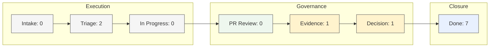

# BrainBench V0.4.3: Visual Command Cockpit
Generated: 2026-06-27T13:09:55Z

<!-- brainbench:generated:visual-snapshot:start -->

## Operating Snapshot

> [!NOTE]
> ### Active Systems: 3
> Status: `Running`

> [!TIP]
> ### Active Sprint: 7 / 7
> Progress: `100%`

> [!TIP]
> ### Field Trial: 3 / 3
> Progress: `100%`

> [!WARNING]
> ### Open Evidence Gaps: 1
> Status: `Attention`

> [!WARNING]
> ### Open Decision Gaps: 1
> Status: `Attention`

> [!NOTE]
> ### Human Review: 0
> Status: `Clear`

<!-- brainbench:generated:visual-snapshot:end -->

<!-- brainbench:generated:visual-sdlc-flow:start -->

## Visual SDLC Pipeline

<!-- brainbench:generated:visual-sdlc-flow:end -->

<!-- brainbench:generated:repo-insight-matrix:start -->

## Repo / System Insight Matrix

| Repo/System | Work State | Risk | Evidence | Decision | Advisory Signal | Next Action |
|---|---|---|---|---|---|---|
| **BrainBench** | No active work | Low | Complete | Clear | Dashboard clarity trial active | Operate from cockpit |
| **DAX** | No active work | Low | Complete | Clear | Verification harness active | Run local validation:

<kbd>bun run typecheck:dax</kbd> · <kbd>bun run test</kbd> · <kbd>dax sdlc verify --format json</kbd> · <kbd>dax sdlc verify --native --format json --receipts</kbd> |
| **Rook** | Done | Low | Complete | Clear | Verification harness active | Run local validation:

<kbd>source bin/activate-hermit</kbd> · <kbd>cargo fmt --check</kbd> · <kbd>cargo clippy --workspace --all-targets --exclude v8 -- -D warnings</kbd> · <kbd>cargo test --workspace</kbd> |
| **Soothsayer** | No active work | Low | Complete | Clear | No active implementation. | Do not modify until the DAX/Rook SDLC verification slice stabilizes. |
| **Flowright** | Done | Low | Complete | Clear | Wait for DAX/Rook SDLC core verification loops to stabilize before wiring kernel orchestration. | Review product positioning |
| **ToolSmith** | Done | Low | Complete | Clear | Support repo visibility, token cost calculations, rule generation, and context packing. | Decide next utility category |
| **Tessera** | Done | Low | Complete | Clear | Establish a catalog of reusable agent step templates and data conversion rules. | Candidate for next build slice |
| **Picobot** | No active work | Low | Complete | Clear | Confirm the exact repository name and owner. | Map the repository in `ecosystem.yml` once confirmed. |
| **PruningMyPothos** | No active work | Low | Complete | Clear | Confirm the exact repository name and owner. | Map the repository in `ecosystem.yml` once confirmed. |

<!-- brainbench:generated:repo-insight-matrix:end -->

<!-- brainbench:generated:quality-gates-by-repo:start -->

## Quality Gates by Repo

| Repo/System | PR Review | Evidence | Decision Gap | Human Review | Overall |
|---|---|---|---|---|---|
| **BrainBench** | Clear | Clear | Clear | None | Healthy |
| **DAX** | Clear | Clear | Clear | None | Healthy |
| **Rook** | Complete | Complete | Clear | None | Healthy |
| **Soothsayer** | Clear | Clear | Clear | None | Healthy |
| **Flowright** | Complete | Complete | Clear | None | Healthy |
| **ToolSmith** | Complete | Complete | Clear | None | Healthy |
| **Tessera** | Complete | Complete | Clear | None | Healthy |
| **Picobot** | Clear | Clear | Clear | None | Healthy |
| **PruningMyPothos** | Clear | Clear | Clear | None | Healthy |

<!-- brainbench:generated:quality-gates-by-repo:end -->

<!-- brainbench:generated:visual-human-review:start -->

## Needs Human Review

| Item | Reason | Suggested Action |
|---|---|---|
| - | No tasks currently requiring human review. | None |

<!-- brainbench:generated:visual-human-review:end -->

<!-- brainbench:generated:repo-action-lanes:start -->

## Repo Action Lanes

<b>BrainBench</b> — No active work · Low · Evidence Complete

| Signal | Status | Action |
|---|---|---|
| Objective: Establish V2 structure containing Brain, Bench, Control, Dashboard, Memory, State, and Systems. | Active | Complete Phase 1 refactor verification and publish dogfooding logs. |
| Freshness | Unknown | No action |
| Evidence | Complete | No action |
| Decision gaps | Clear | No action |

**Handoff Summary**:
- **Latest handoff**: Missing
- **Freshness**: Unknown

<b>DAX</b> — No active work · Low · Evidence Complete

| Signal | Status | Action |
|---|---|---|
| Objective: Add the first SDLC verification harness that treats tests, CI checks, and command outputs as structured evidence. | Active | Run local validation:

<kbd>bun run typecheck:dax</kbd> · <kbd>bun run test</kbd> · <kbd>dax sdlc verify --format json</kbd> · <kbd>dax sdlc verify --native --format json --receipts</kbd> |
| Freshness | Unknown | No action |
| Evidence | Complete | No action |
| Decision gaps | Clear | No action |

**Handoff Summary**:
- **Latest handoff**: Missing
- **Freshness**: Unknown

<b>Rook</b> — Done · Low · Evidence Complete

| Signal | Status | Action |
|---|---|---|
| Add Rook verify command (Refined) | Complete | No action |
| Freshness | Unknown | No action |
| Evidence | Complete | No action |
| Decision gaps | Clear | No action |

**Handoff Summary**:
- **Latest handoff**: Missing
- **Freshness**: Unknown

<b>Soothsayer</b> — No active work · Low · Evidence Complete

| Signal | Status | Action |
|---|---|---|
| Objective: No active implementation. | Paused | Do not modify until the DAX/Rook SDLC verification slice stabilizes. |
| Freshness | Unknown | No action |
| Evidence | Complete | No action |
| Decision gaps | Clear | No action |

**Handoff Summary**:
- **Latest handoff**: Missing
- **Freshness**: Unknown

<b>Flowright</b> — Done · Low · Evidence Complete

| Signal | Status | Action |
|---|---|---|
| [Flowright] Define use-case and product-fit map | Complete | Review product-fit assumptions |
| Freshness | Unknown | No action |
| Evidence | Complete | No action |
| Decision gaps | Clear | No action |

**Handoff Summary**:
- **Latest handoff**: [2026-W26 weekly](file:///Users/ananyalayek/.gemini/antigravity/scratch/brainbench/bench/repo-handoffs/weekly/2026-W26-flowright.md)
- **Freshness**: Fresh
- **Signal**: Monitored DAX/Rook build loop compliance and updated integration notes.
- **Needs BrainBench**: None
- **Risk**: None
- **Recommended next action**: Maintain paused status until core validation loop matures.

<b>ToolSmith</b> — Done · Low · Evidence Complete

| Signal | Status | Action |
|---|---|---|
| [ToolSmith] Define utility roadmap and repo-helper scope | Complete | Select first repo-helper utility |
| Freshness | Unknown | No action |
| Evidence | Complete | No action |
| Decision gaps | Clear | No action |

**Handoff Summary**:
- **Latest handoff**: [2026-06-26 daily](file:///Users/ananyalayek/.gemini/antigravity/scratch/brainbench/bench/repo-handoffs/daily/2026-06-26-toolsmith.md)
- **Freshness**: Fresh
- **Signal**: Implemented and verified the `getLatestHandoff` logic in dashboard-refresh.ts.
- **Needs BrainBench**: None
- **Risk**: None
- **Recommended next action**: Verify dashboard generation loop and decision-gap compliance.

<b>Tessera</b> — Done · Low · Evidence Complete

| Signal | Status | Action |
|---|---|---|
| [Tessera] Define repo-to-use-case utility | Complete | Convert into build issue |
| Freshness | Unknown | No action |
| Evidence | Complete | No action |
| Decision gaps | Clear | No action |

**Handoff Summary**:
- **Latest handoff**: [2026-06-26 daily](file:///Users/ananyalayek/.gemini/antigravity/scratch/brainbench/bench/repo-handoffs/daily/2026-06-26-tessera.md)
- **Freshness**: Fresh
- **Signal**: Drafted a set of reusable step templates for file operations and CLI invocation.
- **Needs BrainBench**: None
- **Risk**: None
- **Recommended next action**: Await stable Flowright integration interface.

<b>Picobot</b> — No active work · Low · Evidence Complete

| Signal | Status | Action |
|---|---|---|
| Objective: Confirm the exact repository name and owner. | Unmapped | Map the repository in `ecosystem.yml` once confirmed. |
| Freshness | Unknown | No action |
| Evidence | Complete | No action |
| Decision gaps | Clear | No action |

**Handoff Summary**:
- **Latest handoff**: Missing
- **Freshness**: Unknown

<b>PruningMyPothos</b> — No active work · Low · Evidence Complete

| Signal | Status | Action |
|---|---|---|
| Objective: Confirm the exact repository name and owner. | Unmapped | Map the repository in `ecosystem.yml` once confirmed. |
| Freshness | Unknown | No action |
| Evidence | Complete | No action |
| Decision gaps | Clear | No action |

**Handoff Summary**:
- **Latest handoff**: Missing
- **Freshness**: Unknown

<!-- brainbench:generated:repo-action-lanes:end -->

<!-- brainbench:generated:visual-agent-advisory:start -->

## Agent Advisory Signals

| Agent | Repo/System | Signal | Confidence | Operator Action |
|---|---|---|---|---|
| Triage Agent | toolsmith | Default low priority assignment. Warning: has unassigned owner, unassigned priority. | `low` | Review roadmap boundary |
| Triage Agent | rook | Touches active core SDLC verification system: rook. | `high` | Review triage suggestions |
| Evidence Agent | rook | Work item is in status `done` but has no mapped PR number in its frontmatter. | High | Link PRs to backlog tasks |
| Decision Gap Agent | Sprint | `state/adapter-registry.yml` | High | Review generated decision drafts |
| Weekly Brief | Sprint | 7 / 7 complete | High | No action |

<!-- brainbench:generated:visual-agent-advisory:end -->

<!-- brainbench:generated:repo-recommended-actions:start -->

## Recommended Actions

### BrainBench

- Continue dashboard clarity trial from `dashboard/index.md`.
- Avoid new architecture changes until one normal sprint completes.

### DAX

- No action needed. System is stable.

### Rook

- No action needed. System is stable.

### Soothsayer

- No action needed. System is stable.

### Flowright

- Review use-case map for product-fit clarity.
- Identify top 3 use cases worth building into examples.

### ToolSmith

- Select first repo-helper utility.
- Keep internal BrainBench scripts separate from future product utilities.

### Tessera

- Convert repo-to-use-case concept into a scoped build task.
- Define input/output schema before implementation.

### Picobot

- No action needed. System is stable.

### PruningMyPothos

- No action needed. System is stable.

<!-- brainbench:generated:repo-recommended-actions:end -->

## Latest Operator Briefs
- [Daily Pulse (Operations)](file:///Users/ananyalayek/.gemini/antigravity/scratch/brainbench/dashboard/daily-report.md)
- [Weekly Review (Trends)](file:///Users/ananyalayek/.gemini/antigravity/scratch/brainbench/dashboard/weekly-report.md)

## Operator Notes

<!-- brainbench:manual:operator-notes:start -->
Use this section for human observations during dashboard clarity trials.

- Cockpit Check 2 Observation: Cockpit correctly identified Rook Issue #12 as the next human-review item and confirmed the cleared state after movement. However, completing the movement required manual edits to active-sprint.yml and supporting evidence/PR files. The cockpit passed as a visibility and verification surface, but the operating loop still has friction around state transitions.
- Remote merge required conflict handling. Local cockpit baseline was retained with -X ours. No state YAML was needed for cockpit operation, but future remote automated runs should be watched for merge noise.
- Cockpit Check 3 Observation: Cockpit Check 3 confirmed that aggregate sprint visibility works, but non-issue backlog tasks are not sufficiently exposed in dashboard/index.md. Completing the task required opening sprint-status.md and editing active-sprint.yml directly. This reinforces the need for a future transition layer rather than more visual dashboard polish.
<!-- brainbench:manual:operator-notes:end -->

## Human Notes
[Add manual notes here. These will be preserved by refresh script.]
