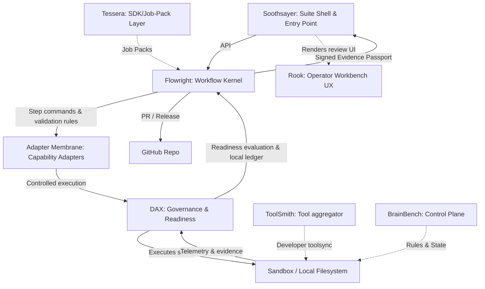

# Project Map

Conceptual relationship of projects:

## System Registries

- **DAX**: [systems/dax/status.md](file:///Users/ananyalayek/.gemini/antigravity/scratch/ai-sdlc-control-plane/systems/dax/status.md)
- **Rook**: [systems/rook/status.md](file:///Users/ananyalayek/.gemini/antigravity/scratch/ai-sdlc-control-plane/systems/rook/status.md)
- **Soothsayer**: [systems/soothsayer/status.md](file:///Users/ananyalayek/.gemini/antigravity/scratch/ai-sdlc-control-plane/systems/soothsayer/status.md)
- **Flowright**: [systems/flowright/status.md](file:///Users/ananyalayek/.gemini/antigravity/scratch/ai-sdlc-control-plane/systems/flowright/status.md)
- **ToolSmith**: [systems/toolsmith/status.md](file:///Users/ananyalayek/.gemini/antigravity/scratch/ai-sdlc-control-plane/systems/toolsmith/status.md)
- **Tessera**: [systems/tessera/status.md](file:///Users/ananyalayek/.gemini/antigravity/scratch/ai-sdlc-control-plane/systems/tessera/status.md)
- **BrainBench**: [systems/brainbench/status.md](file:///Users/ananyalayek/.gemini/antigravity/scratch/ai-sdlc-control-plane/systems/brainbench/status.md)
